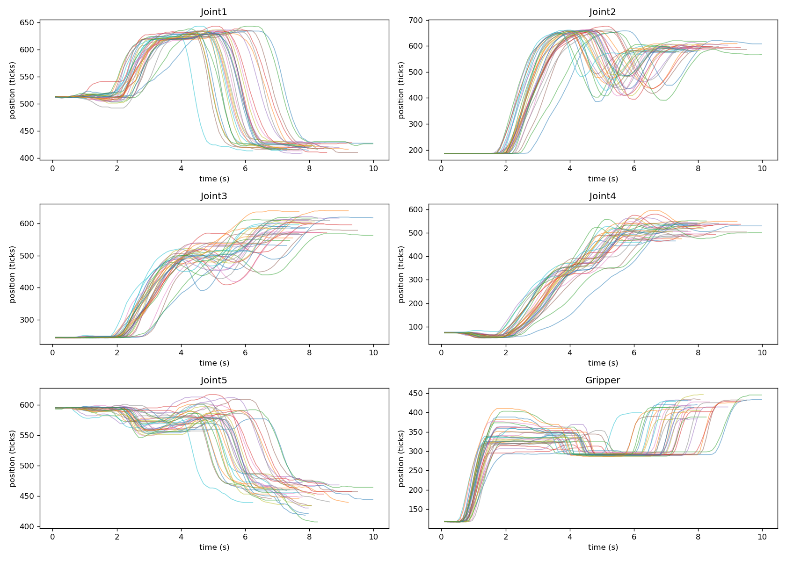
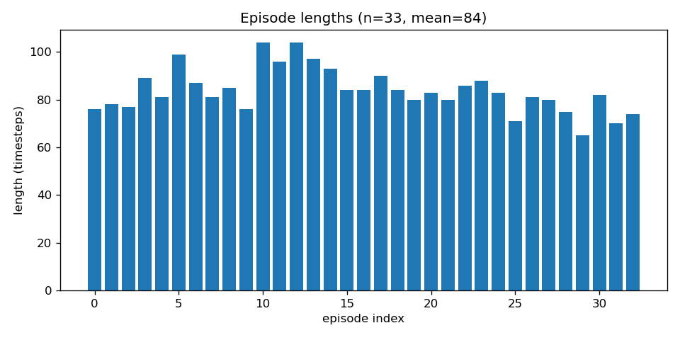
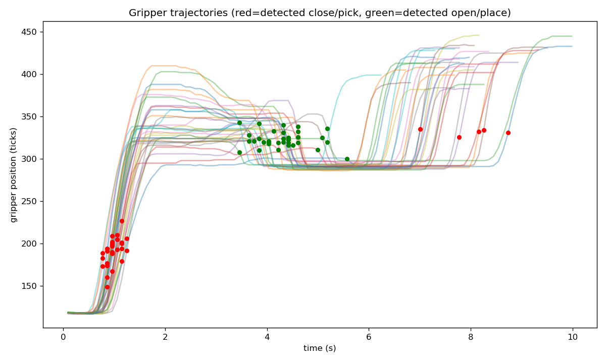
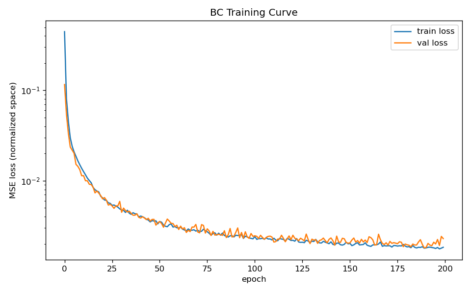
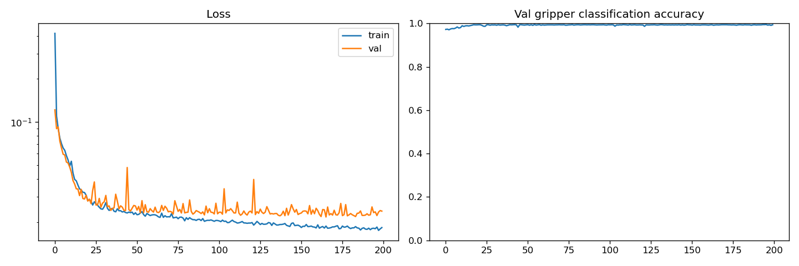

# Leno Arm — Learning Pick-and-Place from Human Demonstrations

A 5-DOF Dynamixel AX-12A robotic arm — built using servos and structural
parts from a [ROBOTIS BIOLOID GP](https://en.robotis.com/model/page.php?co_id=prd_gp)
humanoid robot kit — that learns to pick and place objects purely from
human-guided demonstrations. No inverse kinematics, no simulator: just
proprioception, a behavioral cloning policy, and a lot of trial and error.

This is a personal robotics + imitation learning project exploring real-world
robot learning end-to-end: hardware assembly → kinesthetic data collection
→ data cleaning → policy training → closed-loop deployment.

---


*Close-up of the AX-12A gripper and joint stack.*


*Fully assembled arm mounted on the linear rail, in the pick-and-place workspace.*

---

## Why this project

Most imitation learning research (e.g. Diffusion Policy, ACT/ALOHA, and the
[AWE waypoint extraction paper](https://arxiv.org/abs/2307.14326) this project
draws inspiration from) is demonstrated on expensive hardware. The goal here
was to see how far the same core ideas — behavioral cloning, proprioception-only
policies, closed-loop execution — go on humanoid-kit servos repurposed into
an arm, trained from scratch, without writing a single line of forward/inverse
kinematics.

---

## Pipeline

```
kinesthetic teaching  →  data cleaning  →  visualization  →  BC (LSTM) training  →  closed-loop inference
```

### 1. Data collection — kinesthetic teaching
No leader-follower teleop rig — servo torque is disabled and the arm is
physically hand-guided through each pick-and-place demonstration, while all
6 joint positions (5 arm joints + gripper) are logged at 20Hz. A "go home"
routine returns the arm to a consistent starting pose between every episode.

https://github.com/user-attachments/assets/61afd9ea-0907-4449-8392-dc05966bfc24

 kinesthetic teaching in action: hand-guiding the
arm through a full pick-and-place demonstration while data is logged live.

### 2. Data cleaning (`src/clean_demos.py`)
Raw demos are filtered for:
- Communication glitches (single-step sensor jumps from bus errors)
- Episodes that are too short (accidental/incomplete recordings)
- Length and trajectory-shape outliers, using a self-calibrating
  (median-absolute-deviation based) threshold rather than fixed cutoffs

### 3. Visualization (`src/visualize_demos.py`)
Every batch of demos gets checked visually before training:



*All 6 joint trajectories overlaid across every collected episode — used to spot outliers and confirm consistent task execution.*



*Distribution of episode durations across the dataset.*



*Gripper trajectories with automatically detected close (pick) and open (place) events marked.*



*Train/validation loss curve for the baseline behavioral cloning policy.*



*Training curves for the v2 policy — separate regression (arm) and classification (gripper) heads.*

### 4. Training — Behavioral Cloning with an LSTM (`src/train_bc.py`)
- Input: a short history window of joint positions (proprioception only, no camera yet)
- Output: predicted next joint position (position-control action space)
- Architecture: LSTM + MLP head, trained with MSE loss
- v2: gripper open/close split into its own binary classification head,
  since gripper state is inherently bimodal and a plain regression head
  tends to predict "washy" in-between values for it

### 5. Closed-loop inference on hardware (`src/run_policy.py`)
The trained policy runs autoregressively on the real arm: read current joint
state → predict next state → move → re-read real feedback → repeat.
Exponential smoothing on the continuous arm joint outputs reduces
frame-to-frame jitter, and hard safety clamps (per-step delta limits + joint
range limits) prevent any single bad prediction from causing an unsafe motion.

https://github.com/user-attachments/assets/21d8d66c-97c8-42d4-90f1-701e4e5288a7

https://github.com/user-attachments/assets/e849715d-1681-41de-b2f5-a2f36c3126e1

 the trained policy running autonomously on the real arm.

---

## Current status

Early but working: the pipeline runs end-to-end (collect → clean → train →
deploy), and the policy reproduces the general shape of the pick-and-place
motion. Execution isn't fully reliable yet — ongoing work is focused on
data quantity/consistency and gripper timing.

## Roadmap

- [ ] Scale to more demonstrations per fixed pick-and-place position
- [ ] Randomize object position (currently a fixed-position task)
- [ ] Add a camera and move to a vision-conditioned policy
- [ ] Migrate to proper action-chunking (ACT-style) with temporal ensembling
- [ ] Apply AWE-style automatic waypoint extraction to compress the horizon
- [ ] Convert dataset to LeRobot / RoboMimic format for use with standard training libraries

## Repo structure

```
├── README.md
├── bc_policy.pt              # trained BC policy checkpoint
├── plots/                    # diagnostic plots (see above)
│   ├── all_joints_overlay.png
│   ├── episode_lengths.png
│   ├── gripper_events.png
│   ├── training_curve.png
│   └── training_curve_v2.png
└── src/
    ├── demos3/                 # collected episode data (.h5)
    ├── demos_clean/             # cleaned/filtered episode data
    ├── data_collection1.py      # kinesthetic teaching data recorder
    ├── clean_demos.py           # filters glitches, short episodes, outliers
    ├── visualize_demos.py       # generates the diagnostic plots above
    ├── train_bc.py               # LSTM behavioral cloning training
    ├── run_policy.py             # closed-loop policy execution on real hardware
    ├── home.py                   # move arm to home pose
    ├── goal.py                   # move arm to a specified goal pose
    ├── position.py                # read current joint positions
    ├── bulk_read.py               # bulk-read joint limits/current position from all servos
    ├── find_id.py                 # scan the Dynamixel bus for connected servo IDs
    ├── id.py                      # set/change a servo's ID
    └── limit.py                   # read/set servo angle limits
```

---

## References

- Shi, Sharma, Zhao, Finn — [Waypoint-Based Imitation Learning for Robotic Manipulation (AWE)](https://arxiv.org/abs/2307.14326)
- Zhao et al. — [Learning Fine-Grained Bimanual Manipulation with Low-Cost Hardware (ACT/ALOHA)](https://arxiv.org/abs/2304.13705)
- Chi et al. — [Diffusion Policy](https://arxiv.org/abs/2303.04137)
## Acknowledgments

A huge thank you to Sivabalakrishnan R.  Ph.D., for the guidance throughout this project, 
and to seniors : MADESH KUMAR , ARUNKUMAR M, SABAREESAN K C,Chalus Jude J for all the support along the way.

